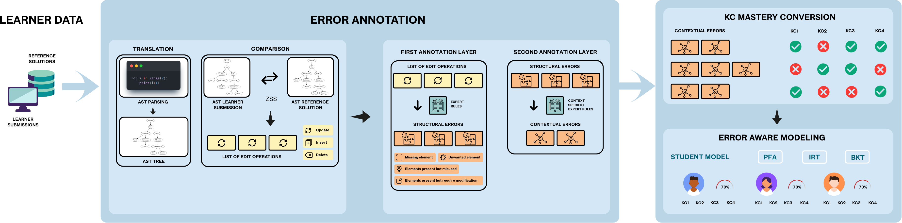

# Enhancing Knowledge Tracing Models with Semantic Error Detection in Programming Tasks

> This repository contains the code and data exclusively for the paper submitted to **EDM 2026** (International Conference on Educational Data Mining).

## Overview

This work investigates whether enriching student knowledge tracing models with fine-grained, semantically grounded error information improves prediction of learner performance on programming exercises. Rather than treating each submission as a binary outcome (correct/incorrect), we use AST-based error detection to identify which specific knowledge components (KCs) a student has mastered or failed, and feed this error-aware signal into knowledge tracing models.

The approach is evaluated on two educational programming platforms using four student modeling techniques (BKT, IRT, PFA, DKT) under two error modalities (error-independent vs. error-dependent).

## Method Pipeline



The pipeline consists of three stages:

### Stage 1 -- Error Annotation

Starting from **learner data** (student code submissions + reference solutions):

1. **Translation**: Both the student submission and reference solution are parsed into Abstract Syntax Trees (ASTs).
2. **Comparison**: The Zhang-Shasha (ZSS) tree edit distance algorithm computes the minimal set of edit operations (update, insert, delete) to transform the student AST into the reference AST.
3. **First Annotation Layer**: The list of edit operations is converted into structural errors (missing elements, unwanted elements, elements present but requiring modification).
4. **Second Annotation Layer**: Structural errors are mapped to contextual errors using a didactic task typology, producing semantically meaningful error tags grounded in the expected knowledge components of each exercise.

### Stage 2 -- KC Mastery Conversion

Contextual errors from the annotation stage are converted into per-KC mastery labels. For each submission, every expected knowledge component receives a mastery status:

- **Error-Independent mode**: All expected KCs inherit the global submission outcome (ok/ko).
- **Error-Dependent mode**: Only the KCs identified in the detected errors are marked as failed; all other expected KCs are marked as mastered. This yields a more granular, skill-level learning signal.

### Stage 3 -- Error-Aware Modeling

The KC mastery sequences are used to train and evaluate four student models:

| Model | Type | Description |
|---|---|---|
| **BKT** (Bayesian Knowledge Tracing) | Probabilistic | Hidden Markov Model tracking latent skill mastery via learn, guess, slip, and forget parameters |
| **IRT** (Item Response Theory) | Probabilistic | 1PL Rasch model estimating student ability and item difficulty |
| **PFA** (Performance Factor Analysis) | Logistic Regression | Predicts performance from skill features and cumulative success/failure counts |
| **DKT** (Deep Knowledge Tracing) | Neural | LSTM-based sequence model learning a continuous knowledge state |

Each model is trained at multiple granularity levels (global, per exercise type, per exercise) and evaluated using stratified k-fold cross-validation with no student-level data leakage.

## Repository Structure

```
edm-2026/
├── error-annotation/          # Stage 1 & 2: AST-based error detection and annotation
│   ├── ast_error_detection/   # Core package (AST parsing, ZSS, error tagging)
│   ├── scripts/               # Batch annotation scripts
│   ├── tests/                 # Ablation tests for error detection
│   ├── config/                # Task typology, reference solutions, error mappings
│   ├── data/                  # Raw and annotated interaction traces
│   ├── main.py                # Interactive demo
│   └── README.md
│
├── student_modeling/          # Stage 3: Knowledge tracing models
│   ├── src/
│   │   ├── bkt/               # Bayesian Knowledge Tracing
│   │   ├── dkt/               # Deep Knowledge Tracing (LSTM)
│   │   ├── irt/               # Item Response Theory (1PL Rasch)
│   │   ├── pfa_model/         # Performance Factor Analysis
│   │   └── common/            # Shared dataset configuration
│   ├── config/                # Exercise metadata, error-to-task mappings
│   ├── data/                  # Platform A and Platform B datasets
│   └── README.md
│
├── method-pipeline.png        # Pipeline diagram (figure from the paper)
├── requirements.txt           # Python dependencies
└── README.md
```

See the component-level READMEs for detailed documentation:
- [`error-annotation/README.md`](error-annotation/README.md) -- Error detection package, annotation pipeline, and configuration
- [`student_modeling/README.md`](student_modeling/README.md) -- Model implementations, usage, and output structure

## Datasets

Experiments are conducted on two educational programming platforms:

| Dataset | Description |
|---|---|
| **Platform A** | 164 programming exercises across 6 series (A-G), covering console display, robot control, and design tasks |
| **Platform B** | Programming exercises with raw code submissions, annotated via the error detection pipeline |

## Getting Started

### Installation

```bash
git clone <repository-url>
cd edm-2026
pip install -r requirements.txt
```

### Dependencies

| Package | Version | Purpose |
|---|---|---|
| `pandas` | | Data manipulation |
| `numpy` | | Numerical computing |
| `scikit-learn` | 1.3.2 | ML metrics, logistic regression, cross-validation |
| `torch` | | Deep learning (DKT) |
| `pyBKT` | 1.4.1 | Bayesian Knowledge Tracing |
| `matplotlib` | | Plotting |
| `seaborn` | | Statistical visualizations |
| `graphviz` | | AST visualization |
| `tqdm` | | Progress bars |

### Running the Full Pipeline

**1. Annotate student code submissions (error detection):**

```bash
cd error-annotation
python scripts/annotate_data.py
```

**2. Train and evaluate student models:**

```bash
cd student_modeling

# Classical models (BKT, IRT, PFA) -- per platform
python src/bkt/run_bkt_platform_a.py
python src/irt/run_irt_platform_a.py
python src/pfa_model/run_pfa_platform_a.py

# Deep model (DKT) -- ablation over hidden dimensions
python src/dkt/run_dkt_experiment.py
```

**3. Compare models and run significance tests:**

```bash
cd student_modeling
python src/compare_dkt_classical.py
python src/statistical_significance_test_global.py
```

## License

This project is licensed under the GNU Affero General Public License v3.0 (AGPL-3.0). See the license headers in source files for details.